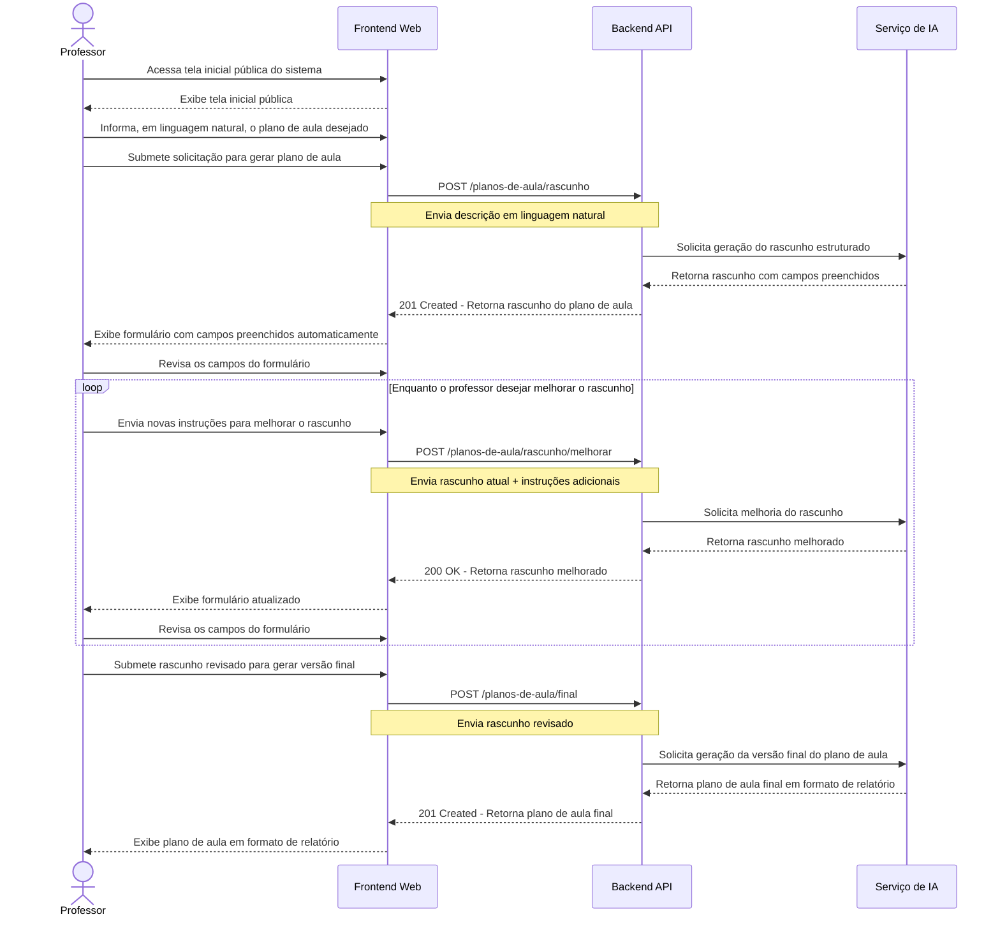

# MeuPlano.AI

## Fluxo Principal - UC01 - Gerar Plano de Aula

```mermaid
sequenceDiagram
    actor Professor
    participant Web as Frontend Web
    participant API as Backend API
    participant IA as Serviço de IA

    Professor->>Web: Acessa tela inicial pública do sistema
    Web-->>Professor: Exibe tela inicial pública

    Professor->>Web: Informa, em linguagem natural, o plano de aula desejado
    Professor->>Web: Submete solicitação para gerar plano de aula

    Web->>API: POST /planos-de-aula/rascunho
    Note over Web,API: Envia descrição em linguagem natural

    API->>IA: Solicita geração do rascunho estruturado
    IA-->>API: Retorna rascunho com campos preenchidos

    API-->>Web: 201 Created - Retorna rascunho do plano de aula
    Web-->>Professor: Exibe formulário com campos preenchidos automaticamente

    Professor->>Web: Revisa os campos do formulário

    loop Enquanto o professor desejar melhorar o rascunho
        Professor->>Web: Envia novas instruções para melhorar o rascunho

        Web->>API: POST /planos-de-aula/rascunho/melhorar
        Note over Web,API: Envia rascunho atual + instruções adicionais

        API->>IA: Solicita melhoria do rascunho
        IA-->>API: Retorna rascunho melhorado

        API-->>Web: 200 OK - Retorna rascunho melhorado
        Web-->>Professor: Exibe formulário atualizado

        Professor->>Web: Revisa os campos do formulário
    end

    Professor->>Web: Submete rascunho revisado para gerar versão final

    Web->>API: POST /planos-de-aula/final
    Note over Web,API: Envia rascunho revisado

    API->>IA: Solicita geração da versão final do plano de aula
    IA-->>API: Retorna plano de aula final em formato de relatório

    API-->>Web: 201 Created - Retorna plano de aula final
    Web-->>Professor: Exibe plano de aula em formato de relatório
```
